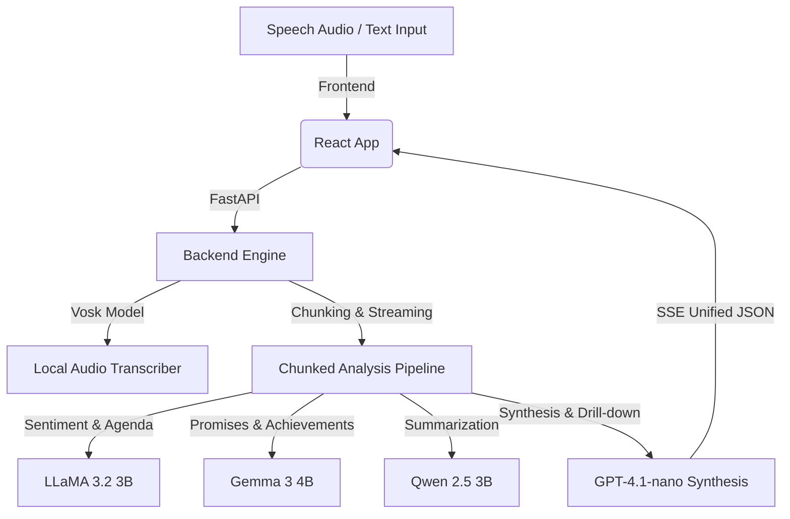

<div align="center">

# 🏛️ Decoding Leadership
### *Multidimensional Analysis of Political Speeches*

**An AI-powered rhetoric intelligence platform that transcribes, dissects, and visualizes political speeches — uncovering sentiment, agendas, promises, and achievements through a pipeline of fine-tuned language models.**

🎓 **Final Year Project (FYP)**

<br/>

[](https://www.python.org/)
[](https://fastapi.tiangolo.com/)
[](https://react.dev/)
[](https://vitejs.dev/)
[](https://platform.openai.com/)
[](https://alphacephei.com/vosk/)
[](https://ffmpeg.org/)

[](#-license)
[](#)

</div>

<br/>

## 📖 Overview

**Decoding Leadership** is an advanced web application and analysis engine built to evaluate political speeches at scale. It combines **local, offline speech-to-text transcription** with a suite of **specialized fine-tuned LLMs** and a **GPT synthesis layer** to produce a rich, multidimensional breakdown of rhetoric — sentiment, policy agendas, promises, achievements, and summarized insights — all streamed live to the frontend as the analysis happens.

---

## 🌟 Core Features

| Feature | Description |
|---|---|
| 🎙️ **Local Speech Transcription** | Transcribes speech audio files fully offline using the **Vosk** (Kaldi-based) speech recognition engine — no cloud dependency, full data privacy. |
| 🧠 **Sentiment & Agenda Mapping** | **LLaMA 3.2 3B** detects overall speech sentiment and maps text segments to political/policy agenda topics (economy, education, defense, etc.). |
| 📜 **Promises & Achievements Extraction** | **Gemma 3 4B** identifies specific, verifiable commitments and accomplishments, and classifies overall speech type. |
| ✍️ **Segment Summarization** | **Qwen 2.5 3B** generates concise segment-level summaries and key bullet-point takeaways. |
| ⚡ **Real-Time SSE Streaming** | Streams analysis progress chunk-by-chunk via Server-Sent Events, giving the frontend live log output as the pipeline runs. |
| 🧩 **Smart GPT Aggregation** | A GPT synthesis layer deduplicates and reconciles overlapping promises/achievements into one unified, coherent report. |
| 🔍 **Agenda Drill-Down Analysis** | Explore any policy topic in depth — view every direct quote tied to it, classified as a promise, achievement, claim, or criticism. |

---

## 🏗️ Architecture



---

## 🛠️ Technology Stack

<div align="center">

### Backend


### AI / LLM Layer


### Frontend


</div>

| Layer | Technology | Purpose |
|---|---|---|
| **Language** | Python 3.11+ | Core backend logic |
| **API Framework** | FastAPI | Asynchronous endpoints & SSE streaming |
| **Speech-to-Text** | Vosk (Offline Kaldi engine) | Local, private audio transcription |
| **Audio Processing** | PyDub & FFmpeg | Audio decoding, chunking, normalization |
| **LLM Orchestration** | HTTPX Async Clients + AsyncOpenAI | Communicates with fine-tuned model microservices & GPT |
| **Frontend Language** | JavaScript (React.js) | Interactive, component-based UI |
| **Build Tool** | Vite | Fast dev server & optimized builds |
| **Styling** | Premium Vanilla CSS | Responsive design, live logs, dynamic charts |

---

## 🚀 Setup & Installation

### ✅ Prerequisites
- Python 3.11+
- Node.js & npm
- `ffmpeg` installed and available on your system `PATH`

### ⚙️ Backend Setup

**1. Navigate to the backend directory and install dependencies**
```bash
cd backend
pip install -r requirements.txt
```

**2. Download the Vosk speech model**

Download a suitable model from [Vosk Models](https://alphacephei.com/vosk/models) (e.g. `vosk-model-small-en-us-0.15` or a standard-sized model), extract it, and rename the folder to `model` inside `backend/`:

```
backend/model/
```

**3. Configure environment variables**

Create a `.env` file inside `backend/`:

```env
OPENAI_API_KEY=your_openai_api_key_here
REMOTE_BASE=https://your-llm-hosting-base-url.dev
```

**4. Run the backend server**
```bash
python main.py
```

> 🌐 The API will be available at `http://localhost:8000`

### 💻 Frontend Setup

**1. Install dependencies**
```bash
cd frontend
npm install
```

**2. Start the development server**
```bash
npm run dev
```

> 🌐 Open `http://localhost:5173` in your browser

---

## 📊 Pipeline Flow

1. **Input** — User uploads a speech audio file or pastes raw text.
2. **Transcription** — Vosk converts audio to text locally (skipped for text input).
3. **Chunking** — The speech is segmented for parallel analysis.
4. **Multi-Model Analysis** — LLaMA, Gemma, and Qwen each process the chunks concurrently for sentiment/agenda, promises/achievements, and summaries respectively.
5. **Streaming** — Results stream to the frontend in real time via SSE.
6. **Synthesis** — GPT-4.1-nano deduplicates and merges outputs into one unified report.
7. **Drill-Down** — Users explore specific agenda topics with full quote-level detail.

---

## 📈 Language Statistics

This repository is configured via `.gitattributes` to emphasize the core engineering component, presenting **Python** as the primary language.

---

## 🤝 Contributing

Contributions, issues, and feature requests are welcome. Feel free to check the [issues page](../../issues) or open a pull request.

## 📄 License

This project is licensed under the **MIT License** — see the `LICENSE` file for details.

---

<div align="center">

**Built with 🧠 AI, ⚡ FastAPI, and ❤️ for political transparency**

</div>
