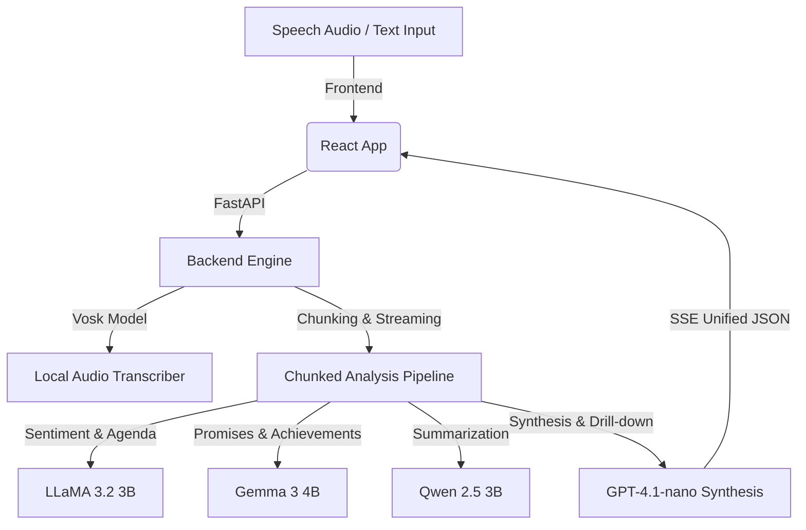

# Decoding Leadership: Multidimensional Analysis of Political Speeches
### 🎓 Final Year Project (FYP)

An advanced web application and analysis engine designed to evaluate, dissect, and visualize the rhetorical patterns, agendas, sentiments, promises, and achievements in political speeches. It uses local speech-to-text models combined with a suite of specialized fine-tuned LLMs and a GPT synthesis layer.

---

## 🌟 Core Features

1. **Local Speech Transcription**: 
   * Transcribe speech audio files locally using the **Vosk** offline speech recognition model (Kaldi-based).
2. **Multidimensional Rhetoric Analysis**:
   * **Sentiment & Agenda (LLaMA 3.2 3B)**: Detects overall speech sentiment and maps portions of the text to political/policy agenda topics.
   * **Promises & Achievements (Gemma 3 4B)**: Extracts specific, verifiable commitments (promises) and accomplishments (achievements) and categorizes speech type.
   * **Summarization (Qwen 2.5 3B)**: Generates detailed segment summaries and key bullet-point takeaways.
3. **Real-time SSE Streaming**:
   * Streams the analysis progress chunk-by-chunk using Server-Sent Events (SSE), offering live log outputs to the frontend.
4. **Smart GPT Aggregation**:
   * Uses a GPT synthesis layer to resolve overlaps, deduplicate promises/achievements, and compile a single, unified analytical report.
5. **Agenda Drill-Down Analysis**:
   * Dive deeper into specific policy fields (e.g., economy, education) to see all direct quotes, classified as promises, achievements, claims, or criticisms.

---

## 🏗️ Architecture



---

## 🛠️ Technology Stack

### Backend
* **Language**: Python 3.11+
* **Framework**: FastAPI (Asynchronous API endpoints & SSE streaming)
* **Speech-to-Text**: Vosk (Offline Kaldi engine)
* **Audio Processing**: PyDub & ffmpeg
* **LLM Integrations**: HTTPX Async Clients to fine-tuned LLM microservices & AsyncOpenAI

### Frontend
* **Language**: JavaScript (React.js)
* **Build Tool**: Vite
* **Styling**: Premium Vanilla CSS (Responsive, featuring dynamic charts, live logs, and modern cards)

---

## 🚀 Setup & Installation

### Backend Setup

1. **Prerequisites**: Ensure you have Python installed and `ffmpeg` configured on your system path.
2. **Install Dependencies**:
   Navigate to the backend directory and install required Python packages:
   ```bash
   cd backend
   pip install -r requirements.txt
   ```
3. **Download Vosk Model**:
   * Download a suitable language model from [Vosk Models](https://alphacephei.com/vosk/models) (e.g., `vosk-model-small-en-us-0.15` or standard model).
   * Extract it and rename the folder to `model` inside the `backend/` directory:
     ```
     backend/model/
     ```
4. **Environment Variables**:
   Create a `.env` file in the `backend/` directory:
   ```env
   OPENAI_API_KEY=your_openai_api_key_here
   REMOTE_BASE=https://your-llm-hosting-base-url.dev
   ```
5. **Run the Server**:
   ```bash
   python main.py
   ```
   The API will start running at `http://localhost:8000`.

### Frontend Setup

1. **Install Dependencies**:
   Navigate to the frontend directory and install NPM packages:
   ```bash
   cd frontend
   npm install
   ```
2. **Run Dev Server**:
   ```bash
   npm run dev
   ```
   Open `http://localhost:5173` in your browser.

---

## 📈 Language Statistics
This repository is configured using `.gitattributes` to emphasize the core engineering component, presenting Python as the primary language.
